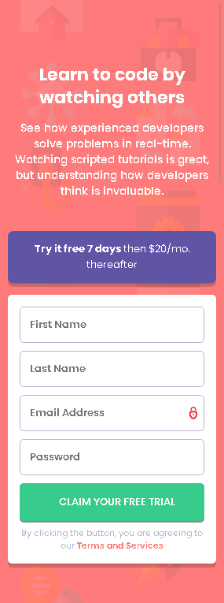

# Frontend Mentor - Intro Component With Sign Up Form Solution

This is a solution to the [Intro component with sign up form challenge on Frontend Mentor](https://www.frontendmentor.io/challenges/intro-component-with-signup-form-5cf91bd49edda32581d28fd1). Frontend Mentor challenges help you improve your coding skills by building realistic projects.

## Table of contents

- [Overview](#overview)
  - [The challenge](#the-challenge)
  - [Screenshot](#screenshot)
  - [Links](#links)
- [My process](#my-process)
  - [Built with](#built-with)
  - [What I learned](#what-i-learned)
  - [Useful resources](#useful-resources)
- [Author](#author)

## Overview

### The challenge

Users should be able to:

- View the optimal layout for the site depending on their device's screen size
- See hover states for all interactive elements on the page
- Receive an error message when the `form` is submitted if:
  - Any `input` field is empty. The message for this error should say *"[Field Name] cannot be empty"*
  - The email address is not formatted correctly (i.e. a correct email address should have this structure: `name@host.tld`). The message for this error should say *"Looks like this is not an email"*

### Screenshot



#### Mobile View


#### Desktop View

### Links

- Solution URL: [Solution URL](https://your-solution-url.com)
- Live Site URL: [Live Site URL](https://your-live-site-url.com)

## My process

### Built with

- Semantic HTML5 markup
- CSS custom properties
- CSS Grid
- Mobile-first workflow
- JavaScript
- Media queries

### What I learned

Learnt a great deal about JavaScript client-side form validation, to ensure the user fill all form fields and email validation by testing with regular expression, this has to happen before submission can be allowed.

Below is the code snippets for the form validation:

```html
<form action="" id="free-trial" name="freeTrialForm" onsubmit="return validateForm()">
  <div class="input-field">
    <input type="text" name="first_name" id="first_name" placeholder="First Name" />
    <div class="error" id="firstNameErr"></div>
  </div>
  <div class="input-field">
    <input type="email" name="email" id="email" placeholder="Email Address" />
    <div class="error" id="emailErr"></div>
  </div>
</form>              
```
```css
/* Error message style */
.error {
  color: hsl(0, 100%, 74%);
  font-size: 0.7rem;
  font-weight: 600;
  font-style: italic;
  text-align: right;
}
/* Displaying inline error icon dynamically */
.error-state {
  border-color: hsl(0, 100%, 74%) !important;
  color: hsl(0, 100%, 74%) !important;
  background-image: url("./images/icon-error.svg") !important;
  background-repeat: no-repeat !important;
  background-attachment: scroll !important;
  background-size: 24px !important;
  background-position: 98% 50% !important;
}
```
```js
let freeTrialForm = document.getElementById("free-trial");
freeTrialForm.addEventListener("click", validateForm);

// Validate form
function validateForm(e) {
  // Prevent default behaviour
  e.preventDefault();

  // Defining a function to display error message
  function printError(elemId, hintMsg) {
    document.getElementById(elemId).innerHTML = hintMsg;
    
  }
  

  // Retrieving the values of form elements
  var first_name = document.freeTrialForm.first_name.value;
  var email = document.freeTrialForm.email.value;

  // var nameErr, emailErr, numberErr, amountErr;
  var firstNameErr = (emailErr = true);

  var inputFirstName = document.getElementById('first_name');
  var inputEmail = document.getElementById('email');

  // Validate firstname
  if (first_name == "") {
    printError("firstNameErr", "First Name cannot be empty");
     inputFirstName.classList.add("error-state");
  } else {
    printError("firstNameErr", "");
    nameErr = false;
     inputFirstName.classList.remove("error-state");

  }

  // Validate email address
  if (email == "") {
    printError("emailErr", "Email Address cannot be empty");
     inputEmail.classList.add("error-state");

  } else {
    // Regular expression for email validation
    var regex = /^\S+@\S+\.\S+$/;
    if (regex.test(email) === false) {
      printError("emailErr", "Looks like this is not an email");
     inputEmail.classList.add("error-state");
    } else {
      printError("emailErr", "");
      emailErr = false;
     inputEmail.classList.remove("error-state");

    }
    
  }

  // Prevent the form from being submitted if there are any errors
  if ((firstNameErr || emailErr || passwordErr) == true) {
    return false;
  }
}
```

### Useful resources

- [JavaScript Form Validation](https://www.tutorialrepublic.com/javascript-tutorial/javascript-form-validation.php) - This helped me learn a great deal about client side form validation. The solution and explanation was so direct and easy to understand.
- [Box Shadow Generator](https://shadows.brumm.af/) - With  this tool it was easier to tweak and achieve the exact type of box shadow that I wanted.

## Author

- Website - [Adekola Olawale](https://studiogenix.netlify.app)
- Frontend Mentor - [@Kola92](https://www.frontendmentor.io/profile/Kola92)
- Twitter - [@olawale_adekola](https://www.twitter.com/olawale_adekola)